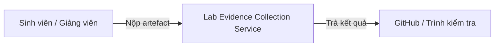

# Service Boundary

## 1. Tên Service
Lab Evidence Collection Service

## 2. Bài toán Service giải quyết
Thu thập và lưu trữ bằng chứng hoàn thành lab FIT4110 Buổi 1, bao gồm log kiểm tra công cụ, danh sách image, kết quả smoke test và tài liệu service boundary.

## 3. Actor
- Sinh viên nhóm
- Giảng viên
- Docker Desktop / Docker Compose (provider cơ sở hạ tầng)
- GitHub (nơi lưu trữ code và evidence)

## 4. Responsibility
- Kiểm tra môi trường công cụ: Git, Docker, Docker Compose, Node.js, Python
- Chạy container cơ bản và mini-stack Compose
- Đọc kết quả `PASS / WARN / FAIL`
- Ghi lại các artefact bắt buộc vào `evidence/buoi-01/`
- Xác định ranh giới dịch vụ, actor, provider, consumer, input/output và API/event dự kiến

## 5. Out of scope
- Triển khai production
- Viết code ứng dụng chính của hệ thống kinh doanh
- Cấu hình dịch vụ phức tạp như PostgreSQL, RabbitMQ, Grafana
- Quản lý người dùng hoặc xác thực

## 6. Input
| Field | Type | Required | Ý nghĩa |
|---|---|---|---|
| git repository | string | Có | Nguồn dữ liệu và artefact của lab |
| docker images | list | Có | Danh sách image cần pull để thử nghiệm |
| smoke test results | text | Có | Kết quả kiểm tra `PASS/WARN/FAIL` |
| evidence checklist | markdown | Có | Kiểm tra artefact đầy đủ |

## 7. Output
- `evidence/buoi-01/README.md`
- `evidence/buoi-01/checklist.md`
- `evidence/buoi-01/known-issues.md`
- `evidence/buoi-01/tool-versions.txt`
- `evidence/buoi-01/docker-version.txt`
- `evidence/buoi-01/compose-version.txt`
- `evidence/buoi-01/hello-world.txt`
- `evidence/buoi-01/image-list.txt`
- `evidence/buoi-01/smoke-test-result.txt`
- `evidence/buoi-01/git-log.txt`
- `evidence/buoi-01/service-boundary.md`

## 8. Provider / Consumer
- Provider: Docker Hub, Docker Desktop, GitHub
- Consumer: Giảng viên, hệ thống kiểm tra submission, nhóm sinh viên

## 9. Upstream / Downstream
- Upstream: Sinh viên, Docker Hub, repository template
- Downstream: GitHub repository, giảng viên đánh giá, Google Sheet nộp link

## 10. API dự kiến
- `GET /lab-status` — kiểm tra trạng thái evidence
- `POST /evidence` — nộp artefact lab
- `GET /artifact-list` — lấy danh sách file evidence
- `POST /verify` — chạy kiểm tra cấu trúc submission

## 11. Event dự kiến
- `evidence-collected`
- `smoke-test-completed`
- `submission-finalized`

## 12. Boundary Diagram

## 13. Vấn đề cần đàm phán ở Buổi 2
1. Phạm vi các image và dịch vụ cần chuẩn bị cho lab tiếp theo
2. Xử lý các lỗi smoke test và ghi known issues
3. Tiêu chí đánh giá ranh giới service và API/event dự kiến
